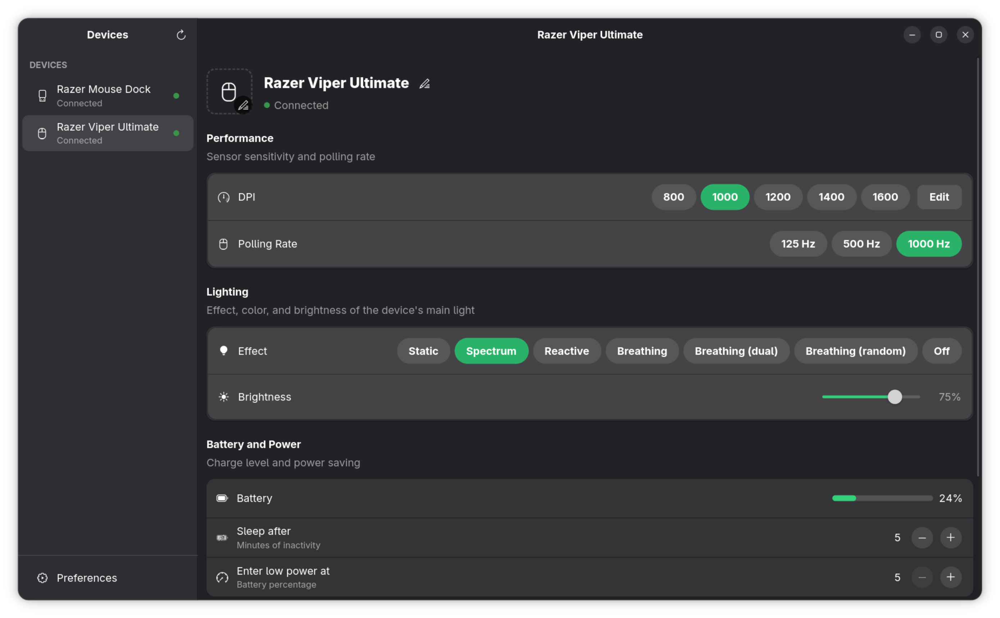
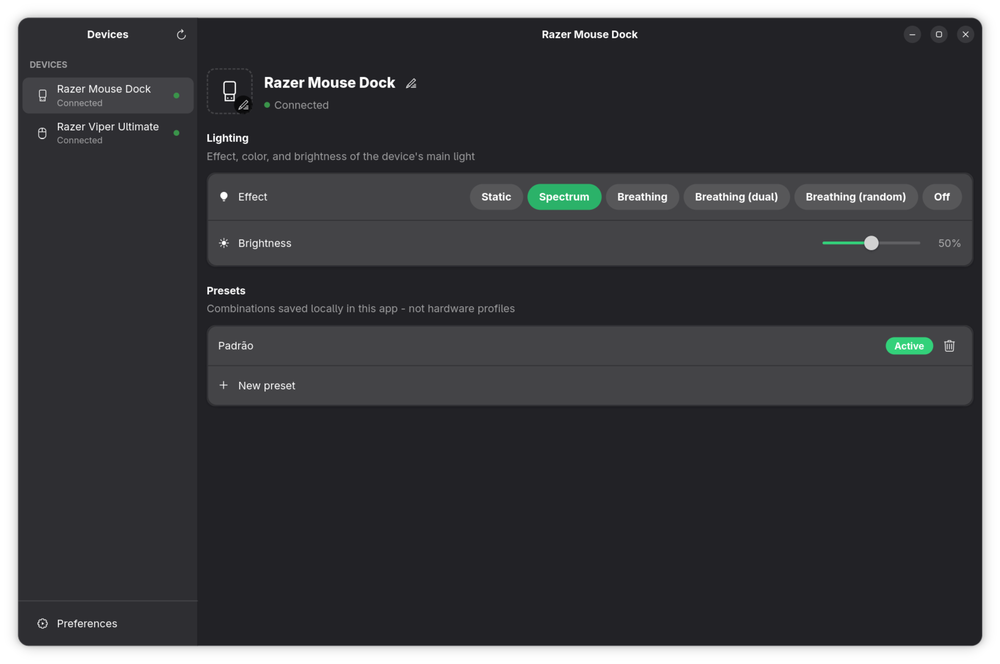

# OpenRazerGTK

A native GTK4/Libadwaita control panel for Razer peripherals, built on top of [OpenRazer](https://openrazer.github.io/).

## Motivation

I wanted to control my Razer mouse and charging dock without leaving the GTK/GNOME environment — no Electron, no Wine, nothing that looks out of place next to the rest of my desktop. OpenRazerGTK follows GNOME HIG conventions (headerbar, sidebar navigation, boxed lists, system accent colors, light/dark theming) instead of porting the Razer Synapse/Polychromatic UI as-is.

The whole interface is **capability-driven**: nothing is shown unconditionally. Every section (DPI, battery, lighting zones, etc.) is derived at runtime from what the connected device actually reports through `python-openrazer` — if a capability isn't there, the section simply doesn't exist, no placeholders or disabled states.

## Screenshots

| Mouse | Dock |
| --- | --- |
|  |  |

## Features

- **DPI control** — discrete stage tables or continuous DPI (with independent X/Y axes where supported), plus a dedicated editor for onboard DPI stages
- **Poll rate**
- **Lighting** — effects, color, and brightness for the device's main light or LED zones
- **Battery & power** — charge level with a charging indicator, idle-sleep timer, low-battery threshold
- **Battery notification settings** — a Preferences page for `openrazer-daemon`'s own low-battery notifications (enable/disable, threshold, check interval), with an in-app prompt to restart the daemon so the change takes effect
- **Local presets** — save/apply/undo combinations of the above (DPI, poll rate, lighting) as app-local snapshots; these are not on-board hardware profiles, since `python-openrazer` doesn't expose an API for those
- **Per-device display name and image** — purely cosmetic overrides, stored locally, the device itself is never touched
- **Tray icon and autostart**
- Automatic light/dark theme and PT-BR/EN-US language (with a restart prompt when the language changes), following system settings

## Built with

- **[GTK 4](https://www.gtk.org/)** + **[Libadwaita](https://gnome.pages.gitlab.gnome.org/libadwaita/)** — UI toolkit and GNOME HIG widgets, via **[PyGObject](https://pygobject.gnome.org/)**
- **[OpenRazer](https://openrazer.github.io/)** (`openrazer-daemon` + `python-openrazer`) — the actual driver/daemon that talks to the hardware over D-Bus
- **[dbus-python](https://dbus.freedesktop.org/doc/dbus-python/)** — pumps D-Bus I/O into GTK's main loop
- **[AyatanaAppIndicator3](https://github.com/AyatanaIndicators/libayatana-appindicator)** (via GTK 3, in a separate process) — the tray icon; GTK 4 has no tray API and AppIndicator only accepts a GTK 3 menu
- **gettext** — PT-BR/EN-US translations

## Requirements

- **`openrazer-daemon`** running — install via your distro's package or follow the [official OpenRazer installation guide](https://openrazer.github.io/#installation); confirm it's up with `systemctl --user status openrazer-daemon` (or your init system's equivalent)
- **`python-openrazer`** — usually installed alongside `openrazer-daemon` by your distro's package; see the [OpenRazer installation guide](https://openrazer.github.io/#installation) if it's missing
- **GTK 4 + Libadwaita ≥ 1.4 and PyGObject** — see [PyGObject's getting-started guide](https://pygobject.gnome.org/getting_started.html) for your distro's package names
- **AyatanaAppIndicator3** (GTK 3 bindings) — needed for the tray icon; e.g. `libayatana-appindicator3` + its GObject-Introspection/typelib package on most distros
- **`dbus-python`**

## Running in development

No install needed:

```sh
python -m razer_gtk
```

## Installing a launcher

To add OpenRazerGTK to your application launcher (icon + `.desktop` entry, user-level, no root needed):

```sh
./install.sh
```

## Status

**Work in progress.** Built and tested primarily against a Razer Viper Ultimate (Wireless) and its charging dock — other devices may behave differently or hit rough edges, since `python-openrazer`'s reported capabilities vary a lot across the Razer lineup. Bug reports welcome.
